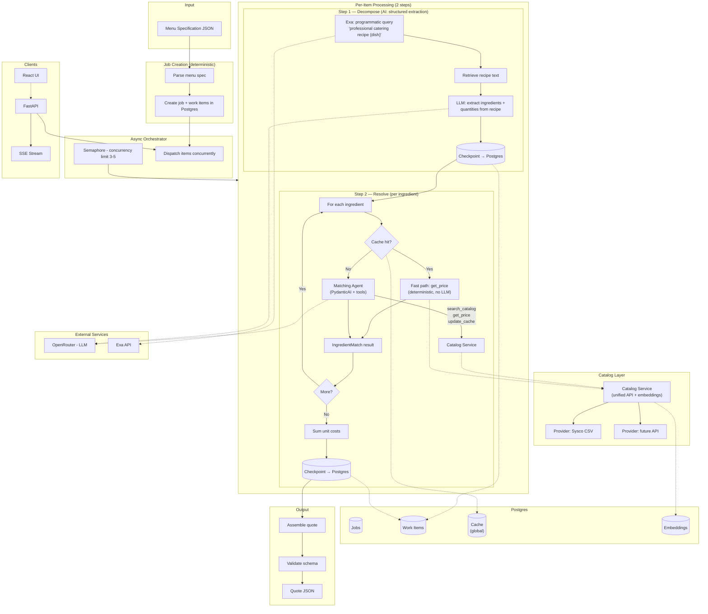
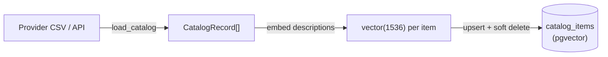
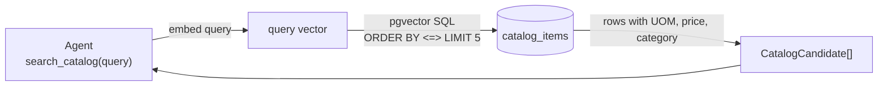

# Yes Chef — AI Catering Estimation Agent

> Phase 1 — Specify (SDD)

---

## Goal

A catering company submits a menu specification describing dishes by name and prose description. The system produces a fully-priced ingredient cost quote as structured output — breaking each dish into component ingredients, matching those ingredients against a supplier catalog, converting case-level pricing to per-serving costs, and handling missing catalog items gracefully. The system must survive interruption mid-run and resume from the last completed step without re-processing completed work or wasting API calls on already-resolved ingredients.

## Workflow Architecture

### AI vs Deterministic Boundaries

| Component | AI? | Guardrails |
|-----------|-----|------------|
| Job creation | No | JSON schema validation |
| Exa recipe search | No | Programmatic query template |
| Ingredient extraction | **Yes** (LLM) | Structured output (Pydantic, `min_length=1`), temperature 0, grounded in recipe text only |
| Quantity estimation | **Yes** (LLM) | Structured output, derived from recipe serving sizes |
| Cache-hit fast path | No | Orchestrator resolves in Python — zero LLM cost |
| Matching agent — search | **Yes** (embeddings) | Cosine similarity over catalog embeddings, top-5 candidates |
| Matching agent — evaluation | **Yes** (LLM) | Must select from provided candidates or declare not_available |
| Matching agent — pricing | No (tool) | LLM interprets UOM string + arithmetic |
| Matching agent — cache write | No (tool) | Postgres upsert, non-fatal on failure |
| Cost rollup | No | Arithmetic sum |
| Quote assembly | No | Schema validation |

### Grounding & Guardrail Strategy

**Principle: the LLM is a reasoning engine over retrieved data, never a source of facts.**

1. **Temperature 0** for all LLM calls.
2. **Structured output** (Pydantic models) on every LLM response — typed, validated, auto-retried on failure (default 3 retries).
3. **Input grounding** — decomposition LLM receives ONLY Exa-retrieved recipe text. Matching agent sees ONLY embedding-retrieved catalog candidates. Neither receives open-ended prompts.
4. **Output constraints** — decomposition extracts from recipe, decomposes compound preparations to base ingredients. Matching selects from candidates or declares `not_available`. Neither can fabricate data.
5. **Separation of concerns** — pricing (UOM parsing + arithmetic), cost rollup, and caching are deterministic Python code in agent tools. The LLM never does math.
6. **Persona enforcement** — system prompts define restricted personas: recipe analyst (decomposition), procurement specialist (matching). Both cite sources, never guess.
7. **Bounded agent loops** — matching agent has a maximum iteration limit to prevent runaway tool-calling.

## Behaviors

### Job Lifecycle

- **JobSubmission:**
  - Given the system is running and the catalog service is available,
  - When a caller submits a valid menu specification,
  - Then the system creates a job with a unique ID, one work item per menu item (each "pending"), and returns the job ID.

- **JobCompletion:**
  - Given a job has items being processed,
  - When the last item finishes (completed or failed),
  - Then the system assembles the final quote from successfully completed items and marks the job as "completed".

### Catalog Layer

- **CatalogProviderInterface:**
  - Given the system needs data from a supplier source,
  - When the Catalog Service ingests or prices from a provider,
  - Then it uses the Provider interface: `load_catalog()` loads all items from that source and returns them normalized to `CatalogRecord` shape (source_item_id, provider, description, unit_of_measure, cost_per_case, category, brand, source_metadata). `get_price(source_item_id)` returns a fresh price and UOM directly from the source. Each provider is a self-contained data adapter — it knows its own schema and normalizes to `CatalogRecord`. The prototype implements one provider (Sysco CSV). Adding a provider means implementing `load_catalog()` and `get_price()` — no other code changes.

- **CatalogServiceInterface:**
  - Given the system needs to search across all providers or price an item,
  - When any component queries the catalog,
  - Then it uses the Catalog Service — a unified API over the `catalog_items` pgvector table:
    - `search(query: str, top_k: int = 5) → list[CatalogCandidate]` — embeds the query, executes a pgvector cosine distance SQL query (`ORDER BY embedding <=> $1 LIMIT top_k`), and returns enriched candidates with description, unit_of_measure, cost_per_case, provider, and similarity_score directly from the table. No post-search provider lookup is performed.
    - `get_price(source_item_id: str, provider: str) → PriceResult` — delegates to the named provider for a fresh price. Used by the cache fast path and on-demand pricing.
    - `ingest(provider_name: str) → None` — the ETL pipeline: loads the provider via `load_catalog()`, embeds all descriptions in batches, soft-deletes existing rows for that provider (`is_active = FALSE`), then upserts new rows into `catalog_items` with `is_active = TRUE`. Replaces `embed_catalog()`. Can be run per-provider at any time without affecting other providers.
    - `has_embeddings() → bool` — async; returns True if at least one active row exists in `catalog_items`.
  - The matching agent interacts ONLY with the Catalog Service. It never knows which provider data came from — the Catalog Service handles routing.

- **UnifiedCatalogIndex:**
  - Given providers have been ingested,
  - When the application searches the catalog,
  - Then all items from all providers live in a single `catalog_items` Postgres table with a `vector(1536)` embedding column, a pgvector HNSW index (cosine ops), metadata columns (unit_of_measure, cost_per_case, category, brand, source_metadata JSONB), and an `is_active` flag for soft deletes. There is no in-memory embedding store. Items are not re-embedded at startup — embeddings persist in the database across restarts. A provider is re-ingested by running `ingest(provider_name)`, which soft-deletes and replaces only that provider's rows.

**Ingestion pipeline:**

**Search flow:**

### Per-Item Processing

Each menu item moves through two steps with a checkpoint after each.

**Step 1 — Decompose:**

- **RecipeRetrieval:**
  - Given a menu item with a name and description,
  - When decomposition begins,
  - Then the system sends a programmatic query to Exa (e.g., "professional catering recipe {dish_name} ingredients per serving") and retrieves the recipe text. The query is deterministic. A crash during "decomposing" restarts both the Exa call and LLM extraction on resume (Exa cost is negligible).

- **IngredientExtraction:**
  - Given recipe text from Exa (or the dish description if Exa is unavailable),
  - When the LLM processes it,
  - Then it returns a structured list of base purchasable ingredients with per-serving quantities (Pydantic structured output, `min_length=1`). The LLM decomposes compound preparations (hollandaise → butter, egg yolks, lemon juice) to base ingredients and derives quantities from the recipe's serving count. An empty ingredient list triggers a validation retry.

- **DecompositionCheckpoint:**
  - Given extraction is complete,
  - Then the ingredient list is persisted to Postgres and the item advances to "decomposed". Interruption after this point does not repeat decomposition.

**Step 2 — Resolve:**

- **IngredientResolution:**
  - Given a menu item has a persisted ingredient list,
  - When resolve begins,
  - Then each ingredient goes through one of two paths:

- **CacheHitFastPath:**
  - Given an ingredient name,
  - When the orchestrator finds a valid cache entry (Postgres lookup, normalized key),
  - Then it resolves the ingredient in deterministic code — no LLM. The cache entry stores `source_item_id` and `provider` (not a price). The fast path calls `catalog_service.get_price(source_item_id, provider)` to fetch a fresh price from the provider, then builds an `IngredientMatch` in Python. If `get_price()` fails (item no longer exists in the provider), the cache entry is invalidated and the ingredient falls through to the matching agent. Prices are always fetched fresh — the `catalog_items` table price is not used for fast-path resolution.

- **MatchingAgentPath:**
  - Given an ingredient has no valid cache entry,
  - When the orchestrator invokes the matching agent (PydanticAI),
  - Then the agent runs with the ingredient name and serving quantity. The LLM decides the tool-call sequence:
    1. `search_catalog(query)` — gets top-5 enriched candidates from pgvector search via Catalog Service. Each candidate includes description, unit_of_measure, cost_per_case, category, brand, provider, and similarity_score — all from the `catalog_items` table, no additional provider call needed.
    2. **Evaluate** — LLM reasons about which candidate best matches. Considers semantic fit, quality tier, product category, UOM compatibility. This is the core AI judgment.
    3. `get_price(source_item_id, provider)` — tool fetches a fresh price from the provider, interprets UOM, computes per-serving cost.
    4. `update_cache(ingredient_name, source_item_id, source, provider)` — persists mapping via Postgres upsert. Non-fatal on failure.
    5. Returns `IngredientMatch` structured output.
  - If no candidate is acceptable: source `"not_available"`, null cost. The agent caches `not_available` mappings too to prevent redundant searches.

- **SourceClassification:**
  - **`"sysco_catalog"`** — exact or near-exact match. The catalog item IS the ingredient.
  - **`"estimated"`** — reasonable approximation. Same category, different quality/brand/spec.
  - **`"not_available"`** — no acceptable match. Specialty item, premium product, or non-food item.
  - The agent explains its classification in a reasoning field (logged, not in final quote).

- **CostRollup:**
  - Given all ingredients resolved,
  - Then sum non-null unit_costs into `ingredient_cost_per_unit`. `not_available` ingredients (null cost) don't contribute. The rollup is the minimum verifiable ingredient cost.

- **ResolveCheckpoint:**
  - Given all ingredients resolved and rollup complete,
  - Then the full line item is persisted to Postgres and the item advances to "completed". Not reprocessed under any circumstances.

### Ingredient Cache

- **Global Cache:**
  - The cache is stored in Postgres and shared across ALL jobs. Key: normalized ingredient name (lowercase, trimmed). Value: source_item_id, source, provider. No prices cached — prices are always fetched fresh. A mapping written during job 1 is available to job 2, eliminating redundant LLM calls for common ingredients.
  - Concurrent writes from parallel items are safe — Postgres upsert with temperature-0 LLM reasoning produces equivalent results regardless of write ordering.

### Persistence & Resumability

- **Checkpointing:**
  - Items progress: pending → decomposing → decomposed → resolving → completed | failed.
  - Checkpoint writes are atomic (single Postgres transaction). A crash during a checkpoint write leaves the item at its previous status.

- **Resumability:**
  - On restart:
    - **"completed"** → skipped.
    - **"decomposed"** → resumes at resolve using persisted ingredient list.
    - **"pending" / "decomposing"** → restarts decomposition.
    - **"resolving"** → restarts resolve. Individual ingredient results are lost (held in memory until final checkpoint), BUT the global cache preserves mappings written before interruption. On restart, these hit the zero-cost fast path. Only un-cached ingredients need fresh agent calls.

- **ItemIsolation:**
  - Each item runs independently. A failure on item N does not affect any other item.

### Concurrency

- **AsyncOrchestration:**
  - Items run concurrently with a configurable semaphore (default 3–5). Items communicate only through the persistent cache and checkpoint store.

### Observability

- **ProgressReporting:** Job status includes per-item step information.
- **RealTimeUpdates:** SSE events for step transitions, item completion, item failure, and job completion. Frontend consumes these via native `EventSource` API.
- **QuoteRetrieval:** Final quote as JSON conforming to `quote_schema.json`.

### Frontend Views

Three views mirror the kitchen workflow (design system: `.interface-design/system.md`):

- **Submit View:** Clean form for menu spec input (JSON upload or paste) + event details. Single CTA: "Start Quote."
- **Kitchen View:** Live progress — ticket cards representing menu items move through stations (Prep → Match → Done) as SSE events arrive. Live counters for total/in-progress/completed/failed.
- **The Pass View:** Final quote review — summary header + expandable line items with ingredient tables. Source badges (Catalog / Estimated / 86'd) on each ingredient. Export as JSON.

### Failure & Recovery

- **Retries:** Tool calls and API requests retry up to 3 times with backoff. PydanticAI auto-retries on structured output validation failure (default 3).

- **GracefulDegradation:** Exa unavailable → decomposition falls back to LLM-only extraction from dish description. Resolve step unaffected.

- **PartialIngredientFailure:** If some ingredients fail within an item, the item still completes with partial results. Failed ingredients get `not_available` + null cost. The item is NOT marked failed.

- **ItemLevelFailure:** If an entire step fails after retries, the item is marked "failed". Other items continue.

- **RateLimiting:** System pauses and waits. No items marked failed. If killed during the wait, standard resumability applies.

- **PartialQuote:** Job completes with failed items → quote contains only successful items. Status reflects failure count.

## Contracts

**Input — Menu Specification:**
- event, date, venue, guest_count_estimate, notes
- categories: map of category name → list of menu items
- Each item: name, description, dietary_notes (nullable), service_style (appetizers only)
- Categories: appetizers, main_plates, desserts, cocktails

**CatalogRecord (what providers return after normalization):**
- source_item_id: str — the provider's native identifier (e.g., Sysco item number, US Foods SKU)
- provider: str — identifier matching the registered provider name (e.g., "sysco", "us_foods")
- description: str — the text that gets embedded
- unit_of_measure: str — e.g., "20/8 OZ", "6/1 GAL"
- cost_per_case: float
- category: str | None — e.g., "produce", "dairy", "meat"
- brand: str | None
- source_metadata: dict — raw source-specific fields preserved as-is (e.g., contract item number, AASIS number, brand column)

**Catalog Provider Interface:**
- `name: str` — provider identifier; must be unique across all registered providers
- `load_catalog() → list[CatalogRecord]` — load all items from the source, normalize to CatalogRecord, return. Malformed rows skipped with a warning.
- `get_price(source_item_id: str) → PriceResult` — fresh price lookup from the source. Raises ItemNotFoundError if the item does not exist.

**Catalog Service Interface:**
- `search(query: str, top_k: int = 5) → list[CatalogCandidate]` — embeds the query, runs pgvector cosine distance SQL against `catalog_items WHERE is_active = TRUE`, returns top-k results enriched with all metadata from the table. No post-search provider call.
- `get_price(source_item_id: str, provider: str) → PriceResult` — delegates to the named provider. Raises ValueError for unknown provider. Raises ItemNotFoundError for unknown item.
- `ingest(provider_name: str) → None` — ETL: load_catalog() → embed descriptions in batches → soft-delete existing provider rows → upsert new rows into catalog_items with is_active=TRUE.
- `has_embeddings() → bool` — async; returns True if catalog_items contains at least one row with is_active=TRUE.

**CatalogCandidate (search result):**
- source_item_id: str
- description: str
- unit_of_measure: str
- cost_per_case: float
- provider: str
- similarity_score: float
- category: str | None
- brand: str | None

**catalog_items table (pgvector):**
- id: UUID PRIMARY KEY
- source_item_id: VARCHAR NOT NULL — provider's native item identifier
- provider: VARCHAR NOT NULL — provider name
- description: VARCHAR NOT NULL — embedded text
- unit_of_measure: VARCHAR NOT NULL
- cost_per_case: FLOAT NOT NULL
- category: VARCHAR (nullable)
- brand: VARCHAR (nullable)
- source_metadata: JSONB (nullable) — raw source-specific fields
- embedding: vector(1536) NOT NULL
- ingested_at: TIMESTAMPTZ NOT NULL DEFAULT NOW()
- is_active: BOOLEAN NOT NULL DEFAULT TRUE
- UNIQUE(provider, source_item_id) — one row per item per provider
- HNSW index on embedding column with vector_cosine_ops
- Index on provider
- Partial index on is_active WHERE is_active = TRUE

**IngredientMatch (Pydantic — agent output OR fast-path built):**
- name: str
- catalog_item: str | None (matched catalog description)
- source_item_id: str | None — provider's native item identifier
- provider: str | None
- source: "sysco_catalog" | "estimated" | "not_available"
- unit_cost: float | None (per-serving cost)
- reasoning: str (logged, not in quote)

**Matching Agent Dependencies (RunContext):**
- catalog: CatalogService
- serving_quantity: str (e.g., "8 oz")

**Ingredient Cache (Postgres, global):**
- key: normalized ingredient name (lowercase, trimmed)
- value: source_item_id (str | None), source, provider (str)
- No prices. Entries invalidated when `get_price()` fails on a cached item.

**Checkpoint State:**
- job_id, item_name, category
- status: pending | decomposing | decomposed | resolving | completed | failed
- step_data: intermediate result for last completed step
- error: str | None

**Output — Quote:**
- quote_id, event, date, venue, generated_at (ISO 8601 string — to be added to quote_schema.json during implementation)
- line_items: list per menu item:
  - item_name, category
  - ingredients: list per ingredient: name, quantity, unit_cost, source, source_item_id
  - ingredient_cost_per_unit: float (sum of non-null unit_costs)

**Job Status:**
- job_id, status, total_items, completed_items, failed_items
- items: list of (item_name, step, status)

**Curl Test Case (YAML — `tests/curl/*.yml`):**
- name: str (human-readable test name)
- request: method (GET|POST), url (path only, base URL from env), headers (optional map), body (optional — inline object or file reference)
- expect: status (int), body (optional — partial match assertions, supports `any_string`, `any_number`, `any_uuid` matchers), headers (optional map)
- setup (optional): steps to run before the test (e.g., create a job first)
- depends_on (optional): name of another test whose response values are referenced via `${prev.field}` interpolation

**SSE Events:**
- item_step_change: job_id, item_name, status, step, timestamp
- item_completed: job_id, item_name, data, timestamp
- item_failed: job_id, item_name, error, timestamp
- job_completed: job_id, timestamp

## Constraints

### Language & Tooling
- Python (latest stable), uv, PydanticAI (latest), FastAPI (latest), pytest.
- SQLAlchemy (latest, async) + Alembic for persistence and migrations. asyncpg driver.
- Pydantic models for API/agent contracts; SQLAlchemy models for persistence. Explicit conversion between them.
- Two PydanticAI agents: decomposition (structured extraction) and matching (tools). Cache hits bypass agents entirely.
- Embedding: text-embedding-3-small via OpenRouter. Stored in Postgres (`catalog_items` pgvector table). Embeddings persist across restarts; startup does not re-embed. Searched via SQL (`ORDER BY embedding <=> $1`).
- Frontend: React (latest). SSE consumed via native `EventSource` API (not Vercel AI SDK — custom SSE events don't fit AI SDK wire format). Design guided by the `interface-design` skill — domain-driven design system stored in `.interface-design/system.md` for consistency across views (job submission, progress tracking, quote display).
- Ruff for linting and formatting (replaces black, flake8, isort). PEP 8 as the style reference. Configured in `pyproject.toml`. Run `ruff check .` and `ruff format .` before every commit.
- CLI-first. TDD non-negotiable.
- Two test layers: (1) pytest unit/integration tests (TDD — write failing test first, then implement), (2) curl integration tests defined in YAML files (`tests/curl/*.yml`) for API endpoint verification. YAML files specify request method, URL, headers, body, and expected response (status code, body assertions). A test runner script executes them against the running API via curl.

### Local Development
- Docker Compose: Postgres + API service.

### AI & External Services
- LLM via OpenRouter (`openrouter:model-name`). Temperature 0.
- LLM used in two operations: (1) ingredient extraction from recipe, (2) catalog matching for cache-miss ingredients only.
- Exa API for recipe retrieval. Programmatic queries. Fallback to LLM-only on failure.
- Embedding: text-embedding-3-small. All catalog items embedded at startup.

### Data & Persistence
- Postgres (Render free tier / Docker local) for everything: jobs, checkpoints, cache, and catalog.
- Catalog: two-tier. Catalog Service (unified API + pgvector search) → Provider (data adapter). `catalog_items` table stores embeddings + all searchable metadata (description, UOM, cost, category, brand, source_metadata JSONB) with a pgvector HNSW index. Prototype: one provider (Sysco CSV). Adding a provider = implementing `load_catalog()` + `get_price()` and running `ingest(provider_name)`.
- Cache: global, cross-job. No prices cached. Cache entries use `source_item_id`.

### Deployment
- Render: API (web service), React (static site), Postgres (managed). All free tier.
- Budget: $50 total.

### Processing
- Async Python + semaphore (default 3–5 concurrent items).
- Failed items don't block quote assembly.
- Output validated against `quote_schema.json`.

### Production Path (documented, not built)
- Temporal.io migration (each step = activity).
- Per-ingredient checkpointing within resolve step.

## Error Cases

- **CatalogServiceUnavailable:** Resolve step fails. Decomposition continues.
- **ExaUnavailable:** Decomposition falls back to LLM-only. Resolve unaffected.
- **ItemFailure:** Item marked "failed" with error. Others continue. Partial progress preserved.
- **PartialIngredients:** Some ingredients fail → item completes with partial results, failed ingredients as `not_available`.
- **Interruption:** Resume from last checkpoint. Cache preserves mappings. Fast path handles previously-resolved ingredients.
- **CatalogParseFailure:** Unparseable CSV rows skipped with warning.
- **RateLimiting:** Pause and wait. If killed during wait, standard resume applies.
- **SchemaValidation:** Quote fails validation → job marked failed.
- **LLMValidationFailure:** Pydantic retry (3x). All fail → item marked failed.

## Out of Scope

- UI design is a separate phase — guided by the `interface-design` skill, not specced here.
- No markup/margin calculations.
- No authentication or multi-tenancy.
- Multi-supplier in prototype — architecture supports it, one provider implemented.
- No historical pricing or price trends.
- No guest-count total projection — per-serving only.
- No Temporal.io — documented as production path.
- No per-ingredient checkpointing — production improvement.

## Plan

> Phase 2 — Plan (SDD)

### Components Affected

1. **Persistence layer** — Postgres schema for jobs, work items, checkpoints, ingredient cache, and the unified `catalog_items` table (pgvector, metadata, soft deletes).
2. **Catalog layer** — Provider interface (returning `CatalogRecord`), Catalog Service (pgvector search, `ingest()` ETL, provider-delegated pricing), Sysco CSV adapter.
3. **Decomposition engine** — Exa recipe retrieval + PydanticAI decomposition agent for structured ingredient extraction.
4. **Resolution engine** — Cache-hit fast path + PydanticAI matching agent with tools (search_catalog, get_price, update_cache). `IngredientMatch` uses `source_item_id`.
5. **Orchestrator** — Sequential job runner with checkpointing, then concurrency.
6. **API layer** — Minimal FastAPI: submit job, get status, get quote, SSE.
7. **Frontend** — React with three views (Submit, Kitchen, The Pass) per `.interface-design/system.md`.

### Sequence of Changes

**Foundation (build and prove first):**

1. **Persistence layer** — must come first. Every other component reads from or writes to Postgres. The schema defines the data contracts all other components depend on. Includes `catalog_items` with all metadata columns, pgvector HNSW index, `is_active` soft-delete flag, and the updated `ingredient_cache` table using `source_item_id` instead of `sysco_item_number`.

2. **Catalog layer** — depends on persistence (`catalog_items` table). Provider loads CSV and returns `CatalogRecord`. Catalog Service `ingest()` normalizes, embeds in batches, and upserts. `search()` queries pgvector directly and returns enriched `CatalogCandidate` with UOM, price, category from the table. Empirically validated: text-embedding-3-small scores 0.61 avg for matched ingredients vs 0.37 avg for unmatched — clear 0.24 separation. 14/14 correct top-1 matches.

3. **Decomposition engine** — depends on persistence (writes checkpoints) but NOT on the catalog layer. Can be built and tested independently with mocked Exa responses.

4. **Resolution engine** — depends on persistence (reads/writes cache, writes checkpoints) AND catalog layer (search, get_price). Uses `source_item_id` throughout. The cache fast path calls `get_price(source_item_id, provider)` for fresh pricing. The matching agent receives enriched candidates from `search()`.

**Wiring (connect the foundation):**

5. **Orchestrator** — depends on persistence, decomposition engine, and resolution engine.

6. **API layer** — depends on orchestrator.

7. **Frontend** — depends on API layer. Quote view uses `source_item_id` in ingredient tables.

### Risk Areas

All identified risks have been derisked:

- **Embedding search quality** — empirically validated. 14/14 correct top-1 matches. 0.24 avg score separation.
- **UOM parsing** — derisked by design. The matching agent interprets UOM strings as part of its reasoning. No regex module needed.
- **Tool calling reliability** — derisked by design. PydanticAI structured output + prompt design + validation retry.
- **Migration safety** — the table rename/restructure is a breaking schema change. For the prototype (local Docker), stopping the API during migration is acceptable.

### Dependencies Map

- **CatalogProviderInterface** → independent
- **CatalogServiceInterface** → depends on: CatalogProviderInterface, catalog_items table
- **UnifiedCatalogIndex** → depends on: CatalogProviderInterface, persistence (catalog_items)
- **RecipeRetrieval** → independent (Exa only)
- **IngredientExtraction** → depends on: RecipeRetrieval
- **DecompositionCheckpoint** → depends on: IngredientExtraction, persistence
- **CacheHitFastPath** → depends on: Global Cache (source_item_id), CatalogServiceInterface
- **MatchingAgentPath** → depends on: CatalogServiceInterface, Global Cache
- **CostRollup** → depends on: all ingredients resolved
- **Orchestrator behaviors** (Checkpointing, Resumability, AsyncOrchestration) → depends on: both engines + persistence
- **API + Frontend** → depends on: orchestrator

## Tasks

> Phase 3 — Tasks (SDD)

### Task 0: Set up test infrastructure and curl test runner

- **Spec behaviors satisfied:** (infrastructure — no spec behavior)
- **Acceptance condition:** Ruff is configured in `pyproject.toml` with PEP 8 rules (line length 88, isort, pyflakes, pycodestyle, bugbear enabled). `ruff check .` and `ruff format .` pass on an empty project. A `tests/curl/` directory exists with the YAML test case schema documented. A test runner script (`tests/curl/run.sh` or `tests/curl/runner.py`) reads YAML files, executes curl commands against a configurable base URL, validates response status and body assertions (including `any_string`, `any_uuid`, `any_number` matchers and `${prev.field}` interpolation), and reports pass/fail per test. A sample YAML test (`tests/curl/health.yml`) validates GET /health → 200. Documented: "No unit test written — test infrastructure, verified by running the runner against a mock endpoint."
- **Depends on:** none

### Task 1: Set up project scaffolding and persistence layer

- **Spec behaviors satisfied:** Checkpointing, Global Cache
- **Acceptance condition:** A Postgres database (via Docker Compose) accepts connections. SQLAlchemy async models define jobs (with status), work items (with step status), ingredient cache (with normalized key), and catalog embeddings. Alembic generates the initial migration (made idempotent). A Python test inserts a job, updates item status through all valid transitions, and reads it back. A cache upsert writes and reads a mapping. Docker Compose starts Postgres + API service.
- **Depends on:** none

### Task 2: Build the Catalog Provider (Sysco CSV adapter)

- **Spec behaviors satisfied:** CatalogProviderInterface, CatalogParseFailure
- **Acceptance condition:** `load_catalog()` parses `sysco_catalog.csv` and returns a list of catalog items (item_number, description, uom, cost_per_case). `get_price(item_number)` returns cost and UOM for a valid item, raises for an unknown item. A test loads the real CSV and verifies item count (565), spot-checks known items, and confirms get_price returns correct values.
  A test with a CSV containing one malformed row verifies the row is skipped with a warning and remaining rows are loaded.
- **Depends on:** none

### Task 3: Build the Catalog Service with embedding search

- **Spec behaviors satisfied:** CatalogServiceInterface, EmbeddingIndex
- **Acceptance condition:** `embed_catalog()` loads all provider items, embeds descriptions via text-embedding-3-small, and stores embeddings in Postgres. `search("applewood smoked bacon")` returns top-5 candidates with the correct Sysco item at rank 1. `get_price(item_number, provider)` delegates to the correct provider and returns cost + UOM. A test verifies search quality against 5+ known ingredient-to-catalog pairs from the embedding test results.
- **Depends on:** Tasks 1, 2

### Task 4: Build the decomposition engine (Exa + LLM extraction)

- **Spec behaviors satisfied:** RecipeRetrieval, IngredientExtraction, DecompositionCheckpoint, GracefulDegradation
- **Acceptance condition:** Given a menu item (name + description), the engine queries Exa for recipe text, passes it to the decomposition agent, and returns a structured ingredient list with per-serving quantities. A test with a mocked Exa response verifies structured output (list of ingredients with names and quantities, min_length=1). A test with Exa unavailable verifies fallback to LLM-only extraction from the dish description. Checkpoint writes ingredient list to Postgres and advances item to "decomposed."
- **Depends on:** Task 1

### Task 5: Build the resolution engine (cache fast path + matching agent)

- **Spec behaviors satisfied:** IngredientResolution, CacheHitFastPath, MatchingAgentPath, SourceClassification, CostRollup, ResolveCheckpoint, PartialIngredientFailure, CatalogServiceUnavailable, Retries
- **Acceptance condition:** Given an ingredient with a cache entry, the fast path resolves it without LLM — calls get_price, computes per-serving cost, returns IngredientMatch. A test verifies zero LLM calls on cache hit. Given an ingredient without a cache entry, the matching agent searches the catalog, evaluates candidates, gets price, updates cache, and returns IngredientMatch with correct source classification. Tests verify: (1) "beef tenderloin" → source "sysco_catalog", (2) a specialty ingredient → source "not_available", (3) cache is populated after agent run, (4) subsequent call for same ingredient hits fast path. Cost rollup sums non-null unit costs. Failed ingredients get not_available + null cost without failing the item.
- **Depends on:** Tasks 1, 3

### Task 6: Wire the orchestrator (sequential pipeline + checkpointing)

- **Spec behaviors satisfied:** JobSubmission, JobCompletion, Checkpointing, Resumability, ItemIsolation, ItemLevelFailure, PartialQuote
- **Acceptance condition:** Submit a menu spec → orchestrator creates a job, processes each item through decompose → resolve, assembles a quote. A test with 3 menu items verifies all reach "completed." A test with one failing item verifies others still complete and the quote contains only successful items. A resume test interrupts mid-processing and verifies: completed items are skipped, decomposed items resume at resolve, resolving items restart resolve (ingredients cached before interruption hit the fast path), pending items restart decomposition.
- **Depends on:** Tasks 4, 5

### Task 7: Add concurrency to the orchestrator

- **Spec behaviors satisfied:** AsyncOrchestration, RateLimiting
- **Acceptance condition:** Items process concurrently with a configurable semaphore (default 3). A test with 6+ items verifies no more than N run simultaneously. Rate limiting pauses and retries without marking items failed.
- **Depends on:** Task 6

### Task 8: Build minimal API layer (submit, status, quote)

- **Spec behaviors satisfied:** ProgressReporting, QuoteRetrieval, SchemaValidation
- **Acceptance condition:** POST /jobs with a menu spec returns a job ID. GET /jobs/{id} returns job status with per-item step info. GET /jobs/{id}/quote returns the final quote conforming to quote_schema.json. Pytest tests cover request validation and response shapes. Curl test YAML files (`tests/curl/`) define the full API contract:
  - `submit_job.yml` — POST /jobs with valid menu spec → 201, job_id returned
  - `submit_invalid.yml` — POST /jobs with empty body → 422
  - `job_status.yml` — GET /jobs/{id} → 200, status + items array
  - `job_not_found.yml` — GET /jobs/{unknown} → 404
  - `get_quote.yml` — GET /jobs/{id}/quote after completion → 200, validates against quote_schema.json
  - `quote_not_ready.yml` — GET /jobs/{id}/quote while processing → 409 or appropriate status
  A test runner script executes all YAML files against the running API and reports pass/fail.
- **Depends on:** Task 6

### Task 9: Add SSE streaming

- **Spec behaviors satisfied:** RealTimeUpdates
- **Acceptance condition:** GET /jobs/{id}/stream returns an SSE stream. Events fire for item_step_change, item_completed, item_failed, and job_completed. A pytest test connects to the stream, submits a job, and verifies events arrive in order. Curl test YAML file:
  - `sse_stream.yml` — GET /jobs/{id}/stream → 200, Content-Type: text/event-stream, receives at least one event
- **Depends on:** Task 8

### Task 10: Build the frontend (Submit view)

- **Spec behaviors satisfied:** Submit View
- **Acceptance condition:** A React page with a form for menu spec input (JSON paste or upload) and event details. Submitting calls POST /jobs and navigates to the Kitchen view. Styled per `.interface-design/system.md` — copper CTA, butcher paper canvas, parchment surfaces.
- **Depends on:** Task 8

### Task 11: Build the frontend (Kitchen view)

- **Spec behaviors satisfied:** Kitchen View
- **Acceptance condition:** A React page showing ticket cards for each menu item. Cards display current station (Prep/Match/Done) and update in real-time via SSE. Live counters show total/in-progress/completed/failed. Cards use left-border accent colors per design system (copper = processing, herb green = done, brick red = failed).
- **Depends on:** Tasks 9, 10

### Task 12: Build the frontend (The Pass view)

- **Spec behaviors satisfied:** The Pass View
- **Acceptance condition:** A React page showing the final quote. Summary header with event name, total items, total cost. Expandable line item cards — collapsed shows item name + cost, expanded shows ingredient table with name, quantity, unit cost, source badge (Catalog/Estimated/86'd), catalog item number. Export as JSON button. Prices use tabular-nums monospace, right-aligned.
- **Depends on:** Tasks 8, 10

### Task 14: Schema migration — catalog_items table and source_item_id rename

- **Spec behaviors satisfied:** UnifiedCatalogIndex
- **Acceptance condition:** A new Alembic migration transforms the schema:
  1. Renames `catalog_embeddings` table → `catalog_items`
  2. Renames `catalog_items.item_number` column → `source_item_id`
  3. Adds columns: `unit_of_measure VARCHAR NOT NULL DEFAULT ''`, `cost_per_case FLOAT NOT NULL DEFAULT 0`, `category VARCHAR`, `brand VARCHAR`, `source_metadata JSONB`, `ingested_at TIMESTAMPTZ NOT NULL DEFAULT NOW()`, `is_active BOOLEAN NOT NULL DEFAULT TRUE`
  4. Drops old unique index on `item_number`, adds composite unique on `(provider, source_item_id)`
  5. Adds partial index on `is_active WHERE is_active = TRUE`
  6. Renames `ingredient_cache.sysco_item_number` column → `source_item_id`
  7. All statements are idempotent (`IF NOT EXISTS`, `IF EXISTS`, `DO $$ ... EXCEPTION WHEN ...`)
  SQLAlchemy model `CatalogEmbedding` is renamed to `CatalogItem` with all new columns. `IngredientCache.sysco_item_number` is renamed to `source_item_id`. Tests verify: (1) `CatalogItem` model can be inserted with all fields including source_metadata JSONB, (2) `IngredientCache` model uses `source_item_id`, (3) composite unique constraint on `(provider, source_item_id)` prevents duplicates.
- **Depends on:** Task 1

### Task 15: Provider contract — CatalogRecord and SyscoCsvProvider update

- **Spec behaviors satisfied:** CatalogProviderInterface
- **Acceptance condition:** `CatalogItem` dataclass is replaced by `CatalogRecord` with fields: source_item_id, provider, description, unit_of_measure, cost_per_case, category, brand, source_metadata. `SyscoCsvProvider.load_catalog()` returns `list[CatalogRecord]` with `source_item_id` (was `item_number`), `provider="sysco"`, and `source_metadata` preserving raw CSV fields (e.g., AASIS number, contract item number). `SyscoCsvProvider.get_price(source_item_id)` replaces `get_price(item_number)`. Provider has a `name: str` property returning `"sysco"`. Tests verify: (1) `load_catalog()` returns `CatalogRecord` instances with all fields populated, (2) `source_metadata` contains raw CSV fields, (3) `get_price()` works with `source_item_id` parameter, (4) malformed CSV rows are skipped with warning.
- **Depends on:** Task 14

### Task 16: Catalog Service — ingest(), enriched search(), remove embed_catalog/load_embeddings

- **Spec behaviors satisfied:** CatalogServiceInterface, UnifiedCatalogIndex
- **Acceptance condition:** `embed_catalog()` is replaced by `ingest(provider_name)` which: loads the provider, embeds all descriptions in batches, soft-deletes existing rows for that provider (`is_active = FALSE`), upserts new rows into `catalog_items` with all metadata and `is_active = TRUE`. `load_embeddings()` is removed (embeddings persist in DB). `search()` returns `CatalogCandidate` with enriched fields: source_item_id, description, unit_of_measure, cost_per_case, provider, similarity_score, category, brand — all read from `catalog_items` table in one query, no post-search provider lookup. `CatalogCandidate.item_number` is renamed to `source_item_id`. `get_price(source_item_id, provider)` replaces `get_price(item_number, provider)`. `has_embeddings()` queries `catalog_items WHERE is_active = TRUE`. Tests verify: (1) `ingest("sysco")` populates `catalog_items` with all metadata columns, (2) re-ingestion soft-deletes old rows and inserts new ones, (3) `search()` returns candidates with UOM and cost from the table, (4) `has_embeddings()` returns True after ingestion and False on empty table.
- **Depends on:** Tasks 14, 15

### Task 17: Resolution engine — source_item_id throughout, enriched candidates

- **Spec behaviors satisfied:** CacheHitFastPath, MatchingAgentPath, SourceClassification
- **Acceptance condition:** `IngredientMatch.sysco_item_number` is renamed to `source_item_id`. The `search_catalog` tool returns enriched candidates (with UOM, cost, category, brand) from `CatalogCandidate`. The `get_price` tool uses `source_item_id` parameter. The `update_cache` tool writes `source_item_id` to `ingredient_cache`. `resolve_from_cache()` reads `source_item_id` from cache and calls `get_price(source_item_id, provider)`. Tests verify: (1) cache fast path uses `source_item_id` field, (2) matching agent receives enriched candidates, (3) cache is written with `source_item_id`, (4) subsequent calls hit fast path with `source_item_id`.
- **Depends on:** Tasks 14, 16

### Task 18: Orchestrator, API, and frontend — source_item_id propagation

- **Spec behaviors satisfied:** QuoteRetrieval, The Pass View
- **Acceptance condition:** Orchestrator builds line items with `source_item_id` (was `sysco_item_number`) in ingredient dicts and step_data. `_line_item_from_step_data()` reads `source_item_id`. API `_build_quote_from_job()` outputs `source_item_id` in ingredient objects. Frontend `ingredientSchema` uses `source_item_id` field. `PassView` renders `source_item_id`. API startup calls `catalog.ingest("sysco")` instead of `catalog.embed_catalog()` when no embeddings exist. Tests verify: (1) quote output contains `source_item_id` not `sysco_item_number`, (2) frontend builds clean with updated schema, (3) curl integration tests pass end-to-end.
- **Depends on:** Tasks 16, 17

### Task 19: Re-ingestion and end-to-end validation

- **Spec behaviors satisfied:** (integration validation — all behaviors)
- **Acceptance condition:** Run `ingest("sysco")` against the live Docker Postgres to populate `catalog_items` with all 565 items including UOM, cost, category, brand, and source_metadata. Verify: (1) all 565 items are active in `catalog_items`, (2) `search("heavy cream")` returns candidates with non-empty `unit_of_measure` and `cost_per_case`, (3) full end-to-end curl test (submit menu → poll → get quote) passes with `source_item_id` in the quote output, (4) no references to `sysco_item_number`, `item_number`, `CatalogItem`, `embed_catalog`, `load_embeddings`, or `catalog_embeddings` remain in source code (excluding alembic migration history). Documented: "No pytest test — validated by integration curl tests and grep verification."
- **Depends on:** Task 18

### Task 20: Deploy to Render

- **Spec behaviors satisfied:** (deployment — no spec behavior, infrastructure task)
- **Acceptance condition:** API runs as a Render web service. Frontend deployed as a Render static site. Postgres is a Render managed instance. A submitted job completes end-to-end in production. Documented: "No test written — deployment infrastructure, verified by end-to-end smoke test."
- **Depends on:** Tasks 9, 12, 19

## Open Questions

None.
